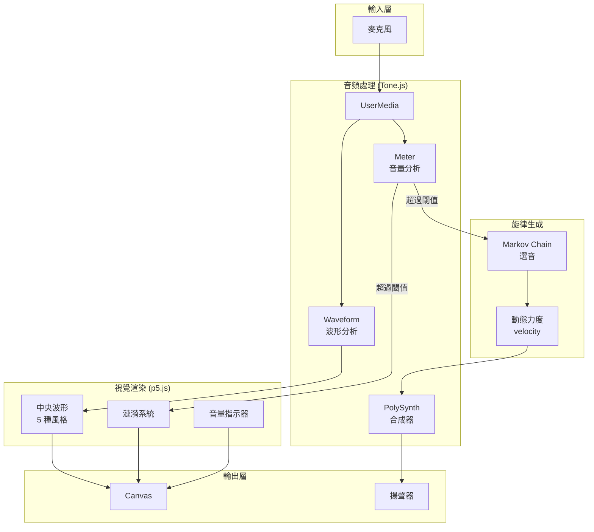
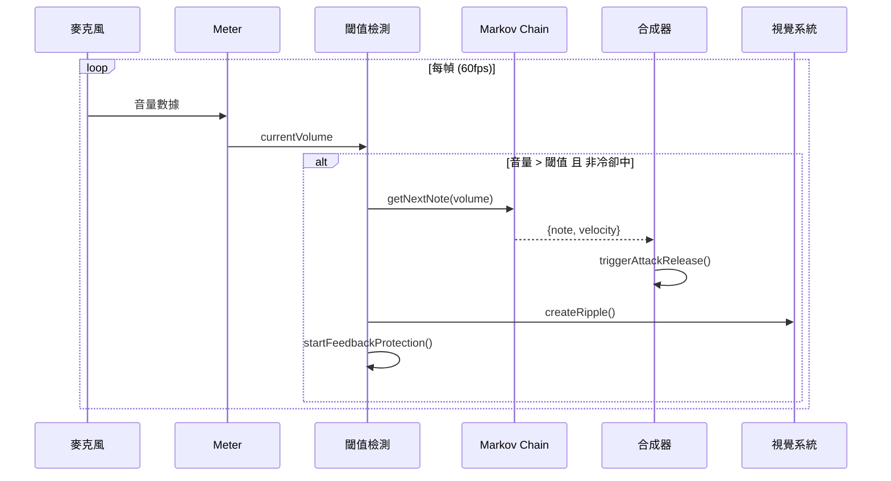

# Voice Ripple Piano

> 聲控雨滴鋼琴 — 你的聲音化為漣漪與音符

[← 回到 Muripo HQ](https://tznthou.github.io/muripo-hq/)

---

## TL;DR

對著螢幕說話、吹氣、拍手，你的聲音會在畫面上激起彩色漣漪，同時觸發隨機的五聲音階旋律。螢幕是一片平靜的深色水面，聲音是投入的石子。

---

## 系統架構



---

## 音頻處理流程



---

## Quick Start

```bash
# 用任何 HTTP 伺服器開啟
npx serve .
# 或
python -m http.server 8000
```

開啟瀏覽器 → 點擊「開始」→ 授予麥克風權限 → 開始說話！

> **Note**
> 建議使用耳機以避免音訊回授

---

## 功能特色

| 功能 | 說明 |
|------|------|
| **聲音觸發** | 說話、吹氣、拍手都會產生回應 |
| **即時波形** | 中央的圓形視覺化顯示聲音的波形 |
| **5 種風格** | 直線 / 螺旋 / 波浪 / 有機 / 花瓣 |
| **彩色漣漪** | 每次觸發產生隨機顏色的漣漪擴散 |
| **Lydian 調式** | C Lydian 音階 (C D E F# G A B)，飄浮夢幻感 |
| **Markov Chain** | 旋律生成非隨機，有連貫的音樂性 |
| **動態力度** | 說話大聲音符力度強，小聲力度輕 |
| **回授防護** | 智慧避免電腦發出的聲音觸發自己 |
| **隱私安全** | 聲音僅在本地處理，不錄音、不上傳 |

---

## 視覺風格


---

## 技術架構

| 層面 | 技術 | 版本 | 用途 |
|------|------|------|------|
| 視覺渲染 | p5.js | 1.11.2 | Canvas 繪圖、動畫循環 |
| 音頻處理 | Tone.js | 14.8.49 | 麥克風輸入、音量分析、合成器 |
| 樣式 | Tailwind CSS | 4.0 | UI 元件樣式 |

### 安全措施

- **SRI 檢查**：p5.js 和 Tone.js CDN 加入 `integrity` 屬性
- **錯誤處理**：區分 `NotAllowedError` / `NotFoundError` / `NotSupportedError`
- **資源清理**：頁面卸載時自動 `dispose()` 所有 Tone.js 物件

---

## 專案結構

```
day-09-voice-ripple/
├── index.html        # HTML 結構 + CDN 載入（含 SRI）
├── style.css         # 補充樣式
├── js/
│   ├── main.js       # p5.js 入口
│   ├── config.js     # 設定參數
│   ├── audio.js      # 音頻系統 + 回授防護
│   ├── melody.js     # Markov Chain 旋律生成
│   └── visual.js     # 視覺系統（5種風格）
├── README.md
└── LICENSE
```

---

## 回授防護機制


為了避免電腦播放的聲音被麥克風收到而造成無限循環：

1. **冷卻時間** — 180ms 內不再觸發
2. **靜音期** — 80ms 內完全停止監測
3. **動態閾值** — 臨時提升閾值 +0.04

---

## 可調參數

所有參數都集中在 `sketch.js` 的 `CONFIG` 物件：

### 音頻參數

| 參數 | 預設值 | 說明 |
|------|--------|------|
| `BASE_THRESHOLD` | 0.03 | 音量觸發閾值 (0-1) |
| `COOLDOWN_MS` | 180 | 觸發後冷卻時間 |
| `SILENCE_MS` | 80 | 靜音期（停止監測） |
| `DYNAMIC_BOOST` | 0.04 | 動態閾值提升量 |

### 視覺參數

| 參數 | 預設值 | 說明 |
|------|--------|------|
| `BASE_RADIUS` | 140 | 中央波形基礎半徑 |
| `WAVE_MULTIPLIER` | 450 | 波形放大倍率 |
| `RIPPLE_EXPAND_SPEED` | 3.5 | 漣漪擴散速度 |
| `RIPPLE_FADE_SPEED` | 2 | 漣漪淡出速度 |
| `MAX_RIPPLES` | 30 | 最大同時存在漣漪數 |

### Lydian 調式音階

```
C Lydian（跨三個八度）
C3, D3, E3, F#3, G3, A3, B3
C4, D4, E4, F#4, G4, A4, B4
C5, D5, E5, F#5, G5, A5, B5
```

Lydian 調式的特色是升四度 (F#)，聽起來飄浮、夢幻，非常適合這個互動體驗。

### Markov Chain 旋律生成

不再是隨機選音，而是根據前一個音符決定下一個：

| 移動量 | 音樂意義 | 機率 |
|--------|----------|------|
| -3 | 跳進下行 | 5% |
| -2 | 級進下行 | 10% |
| -1 | 小二度下行 | 20% |
| 0 | 同音重複 | 10% |
| +1 | 小二度上行 | 25% |
| +2 | 級進上行 | 15% |
| +3 | 跳進上行 | 5% |
| 回主音 | 回到 C | 10% |

**設計理由**：
- 級進占 45%，旋律平滑
- 上行 45% vs 下行 35%，略有朝氣（符合 Lydian 飄浮感）
- 回主音 10%，確保調性穩定
- 第一個音固定從 C4 開始，給聽眾調性錨點

---

## 瀏覽器支援

需要支援以下 API：
- Web Audio API
- getUserMedia (麥克風存取)
- HTTPS 或 localhost

| 瀏覽器 | 支援 |
|--------|------|
| Chrome 74+ | ✅ |
| Firefox 76+ | ✅ |
| Safari 14.1+ | ✅ |
| Edge 79+ | ✅ |

---

## License

[MIT](LICENSE)
