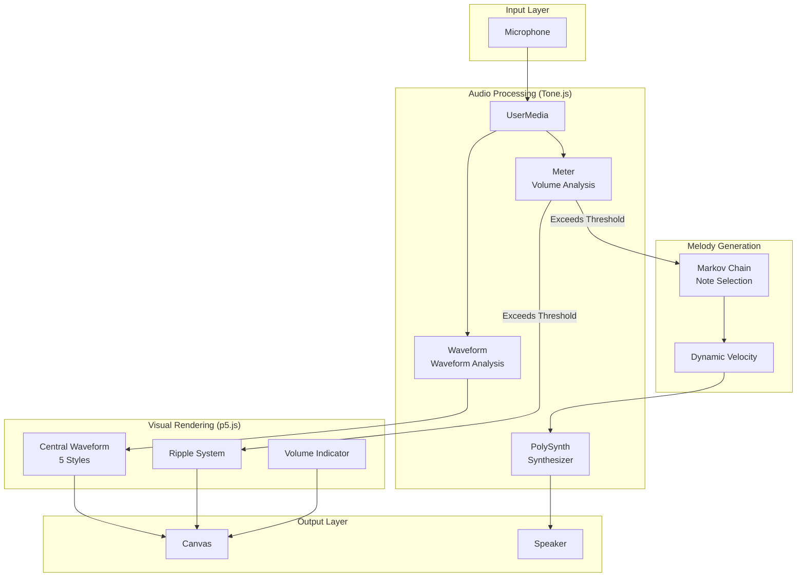
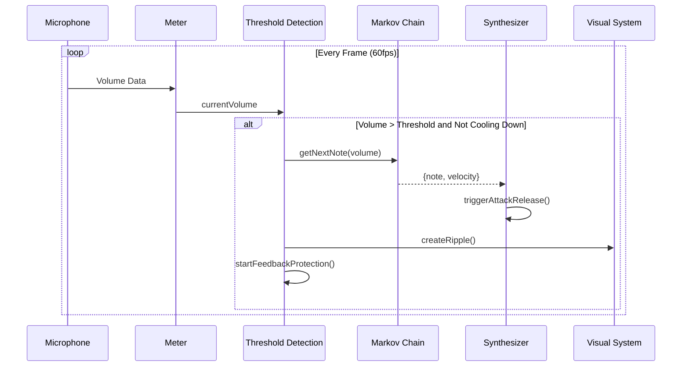
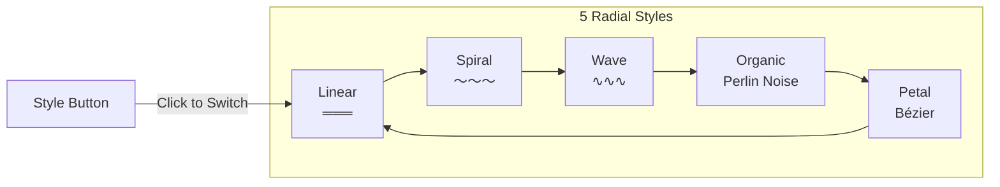
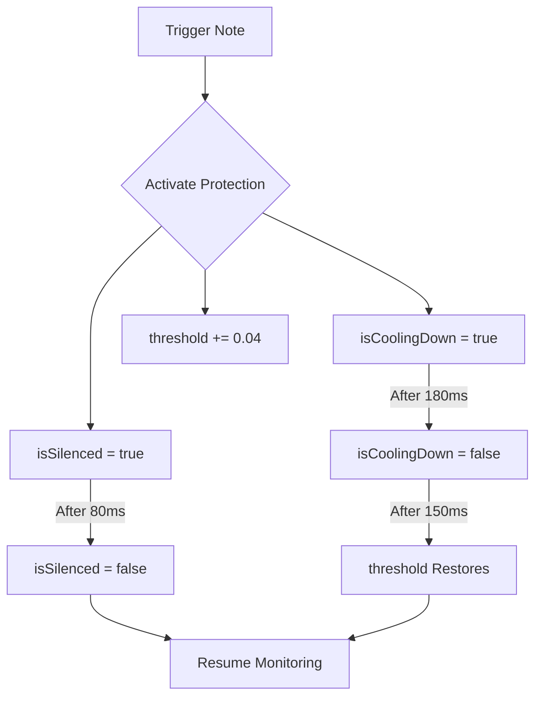

# Voice Ripple - Ripples Born from Your Voice

[](https://creativecommons.org/licenses/by/4.0/)
[](https://tznthou.github.io/day-09-voice-ripple/)
[](https://p5js.org/)
[](https://tonejs.github.io/)

> Voice-controlled Ripple Piano — Ripples born from your voice

[← Back to Muripo HQ](https://tznthou.github.io/muripo-hq/) | [中文](README.md)

---

## TL;DR

Speak, blow, or clap into the screen — your voice will create colorful ripples on the display while triggering random pentatonic melodies. The screen is a calm, dark water surface; your voice is the stone cast into it.

---

## System Architecture



---

## Audio Processing Flow



---

## Quick Start

```bash
# Open with any HTTP server
npx serve .
# or
python -m http.server 8000
```

Open browser → Click "Start" → Grant microphone permission → Start speaking!

> **Note**
> Headphones are recommended to avoid audio feedback

---

## Features

| Feature | Description |
|---------|-------------|
| **Voice Trigger** | Speaking, blowing, clapping all generate responses |
| **Real-time Waveform** | Circular visualization in the center displays sound waveform |
| **5 Styles** | Linear / Spiral / Wave / Organic / Petal |
| **Colorful Ripples** | Each trigger creates ripples with random colors |
| **Lydian Mode** | C Lydian scale (C D E F# G A B), floating and dreamy feel |
| **Markov Chain** | Melody generation is non-random, with musical coherence |
| **Dynamic Velocity** | Loud voice = strong note velocity, soft voice = gentle |
| **Feedback Protection** | Smart prevention of computer sounds triggering themselves |
| **Privacy Safe** | Audio is processed locally only, no recording, no uploading |

---

## Visual Styles



---

## Technical Architecture

| Layer | Technology | Version | Purpose |
|-------|------------|---------|---------|
| Visual Rendering | p5.js | 1.11.2 | Canvas drawing, animation loop |
| Audio Processing | Tone.js | 14.8.49 | Microphone input, volume analysis, synthesizer |
| Styling | Tailwind CSS | 4.0 | UI component styling |

### Security Measures

- **SRI Check**: p5.js and Tone.js CDN include `integrity` attributes
- **Error Handling**: Distinguishes `NotAllowedError` / `NotFoundError` / `NotSupportedError`
- **Resource Cleanup**: Automatically `dispose()` all Tone.js objects when page unloads

---

## Project Structure

```
day-09-voice-ripple/
├── index.html        # HTML structure + CDN loading (with SRI)
├── style.css         # Supplementary styles
├── js/
│   ├── main.js       # p5.js entry point
│   ├── config.js     # Configuration parameters
│   ├── audio.js      # Audio system + feedback protection
│   ├── melody.js     # Markov Chain melody generation
│   └── visual.js     # Visual system (5 styles)
├── README.md
└── LICENSE
```

---

## Feedback Protection Mechanism



To prevent sounds played by the computer from being picked up by the microphone and causing infinite loops:

1. **Cooldown Time** — No triggering within 180ms
2. **Silence Period** — Complete monitoring stop for 80ms
3. **Dynamic Threshold** — Temporarily raise threshold by +0.04

---

## Configurable Parameters

All parameters are centralized in the `CONFIG` object in `sketch.js`:

### Audio Parameters

| Parameter | Default | Description |
|-----------|---------|-------------|
| `BASE_THRESHOLD` | 0.03 | Volume trigger threshold (0-1) |
| `COOLDOWN_MS` | 180 | Cooldown time after trigger |
| `SILENCE_MS` | 80 | Silence period (monitoring stopped) |
| `DYNAMIC_BOOST` | 0.04 | Dynamic threshold boost amount |

### Visual Parameters

| Parameter | Default | Description |
|-----------|---------|-------------|
| `BASE_RADIUS` | 140 | Central waveform base radius |
| `WAVE_MULTIPLIER` | 450 | Waveform amplification factor |
| `RIPPLE_EXPAND_SPEED` | 3.5 | Ripple expansion speed |
| `RIPPLE_FADE_SPEED` | 2 | Ripple fade speed |
| `MAX_RIPPLES` | 30 | Maximum simultaneous ripples |

### Lydian Mode Scale

```
C Lydian (spanning three octaves)
C3, D3, E3, F#3, G3, A3, B3
C4, D4, E4, F#4, G4, A4, B4
C5, D5, E5, F#5, G5, A5, B5
```

The characteristic of Lydian mode is the raised fourth (F#), which sounds floating and dreamy — perfect for this interactive experience.

### Markov Chain Melody Generation

Instead of random note selection, the next note is determined by the previous one:

| Movement | Musical Meaning | Probability |
|----------|-----------------|-------------|
| -3 | Skip down | 5% |
| -2 | Step down | 10% |
| -1 | Minor second down | 20% |
| 0 | Same note repeat | 10% |
| +1 | Minor second up | 25% |
| +2 | Step up | 15% |
| +3 | Skip up | 5% |
| Return to tonic | Return to C | 10% |

**Design Rationale**:
- Stepwise motion accounts for 45%, keeping melody smooth
- Upward 45% vs downward 35%, slightly spirited (matching Lydian's floating feel)
- Return to tonic 10%, ensuring tonal stability
- First note always starts from C4, giving listeners a tonal anchor

---

## Browser Support

Requires support for the following APIs:
- Web Audio API
- getUserMedia (microphone access)
- HTTPS or localhost

| Browser | Support |
|---------|---------|
| Chrome 74+ | ✅ |
| Firefox 76+ | ✅ |
| Safari 14.1+ | ✅ |
| Edge 79+ | ✅ |

---

## Afterword

The original intention of this work was to let everyone's voice transform into a melody. Currently, it only achieves "triggering notes" — there's still a distance to go before "composing phrases." The world of music is deeper than I imagined; there's clearly a long road ahead.

---

## Acknowledgments

Special thanks to **Lovena Huang** for her invaluable musical advice.

If this work sounds like it has any musical taste, that's all thanks to Lovena Huang; if it sounds strange, that's because I didn't learn well enough.

---

## License

[](https://creativecommons.org/licenses/by/4.0/)

This work is licensed under a [Creative Commons Attribution 4.0 International License](https://creativecommons.org/licenses/by/4.0/).

**You are free to:**
- Share — copy and redistribute the material in any medium or format
- Adapt — remix, transform, and build upon the material for any purpose, even commercially

**Under the following terms:**
- Attribution — You must give appropriate credit, provide a link to the license, and indicate if changes were made

---

## Author

Tzu-Chao - [tznthou@gmail.com](mailto:tznthou@gmail.com)
